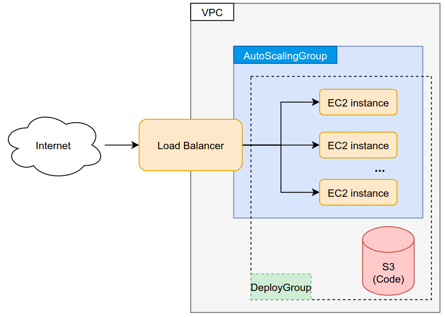
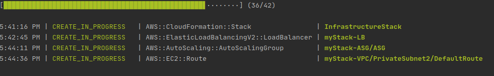
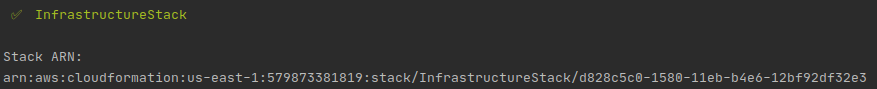
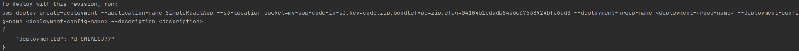
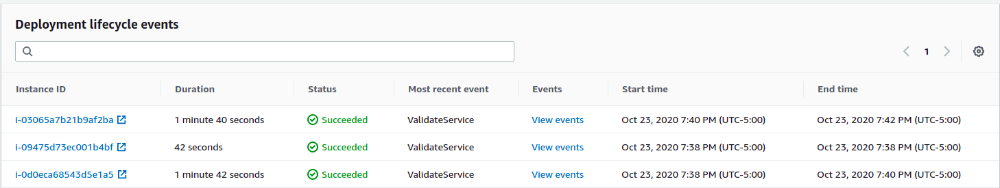
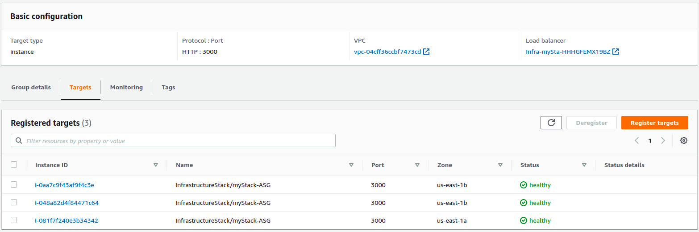
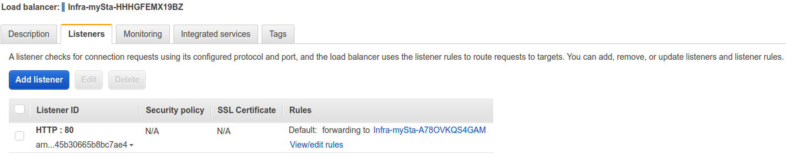
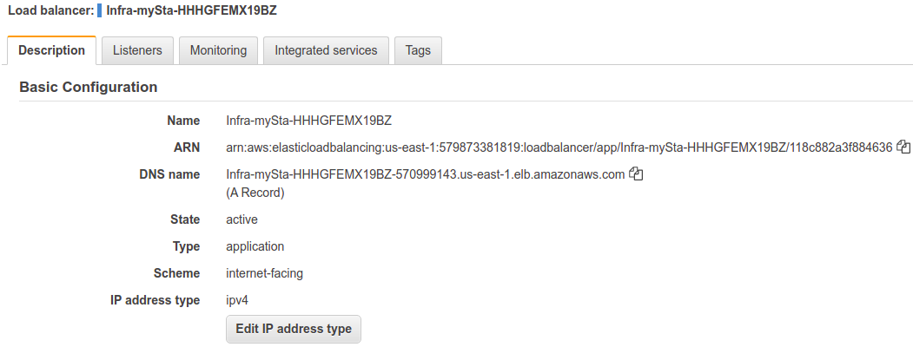
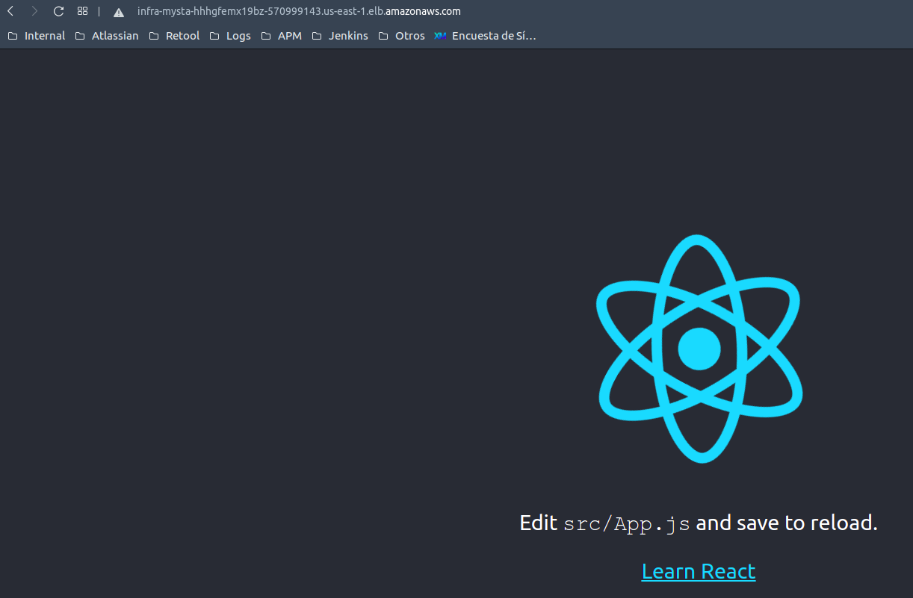

# Automation deployment in AWS

This project is an example of how to build an automated infrastructure and deployment for an App in AWS using CDK, 
for this example we are using an empty React JS App

## Requirements
* aws-cdk
* aws-cli (v2+)
* An account in AWS
* node-js
* npm (5.2+)

You need to have your credential for the AWS configured in to aws-cli, you can do this with `aws configure` in the console

## Automation

### How to run
Just run execute the bash script `build.sh`, if you have problems executing the script make sure to have te correct permission for the file
run `sudo chmod +x build.sh` to grant execution permissions to the file.

To remove the infrastructure and, the generated code use the `delete.sh` script, access the AWS console and make sure thar everything
has been deleted, some components like the S3 Bucket aren't removed with this script.

### Architecture

### Step by step
we run the CDK project to create the specified infrastructure.

we use CDK to build the infrastructure components: VPC, LoadBalancer, securityGroup, AutoScalingGroup, ServerApplication
DeploymentGroup and configure them, finally a S3 bucket that will be used to store our source code for the application.

You can init a new project for CDK with `cdk init app --language javascript` more info in the [AWS Doc](https://docs.aws.amazon.com/cdk/latest/guide/work-with-cdk-javascript.html).

Finally, we generate our app source code with the `npx create-react-app dummy-react-app` command (you can omit this step and build an actual project)
Also we remove the node_modules folder that have the node dependencies.

Then wait until al the infrastructure is ready, we use the S3 to push our final code to the bucket associating it with our App created with CDK that has already 
configured all the infrastructure requirements, the las command deploys the App using the source code form S3, CodeDeploy uses,
scripts to install de packages required to run the App as `npm`, also starts the rect app automatically.

We configured an AutoScalingGroup that starts with 3 instances, but it can create a fourth one if required, this new instance will be created and then 
deployed with the code of our App inside the S3 bucket including the build scripts, this happens because the AutoScalingGroup has a 
DeployGroup targeting it. 

Inside the AWS console we can find the status of our deployment.

Now in the AWS console in the EC2 service, inside the load balancer tab we can find the generated load balancer
and, the target groups

All the instances are healthy and responding through the 3000 port, the load balancer listener link this ports form each machine
to its own IP through the 80 port.

Now we can use the DNS name assigned to the load balancer to access our App 

## Autor
* **[Sergio Rodríguez](https://github.com/SergioRt1)** 
  
## License
This project is license under the Apache-2.0 License - see the [LICENSE](LICENSE) file for more details.

